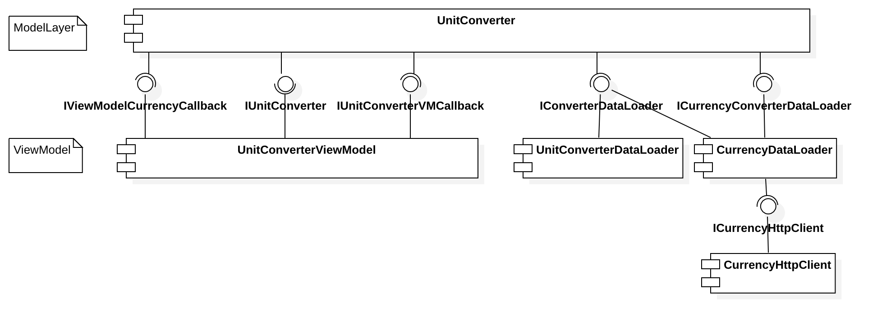
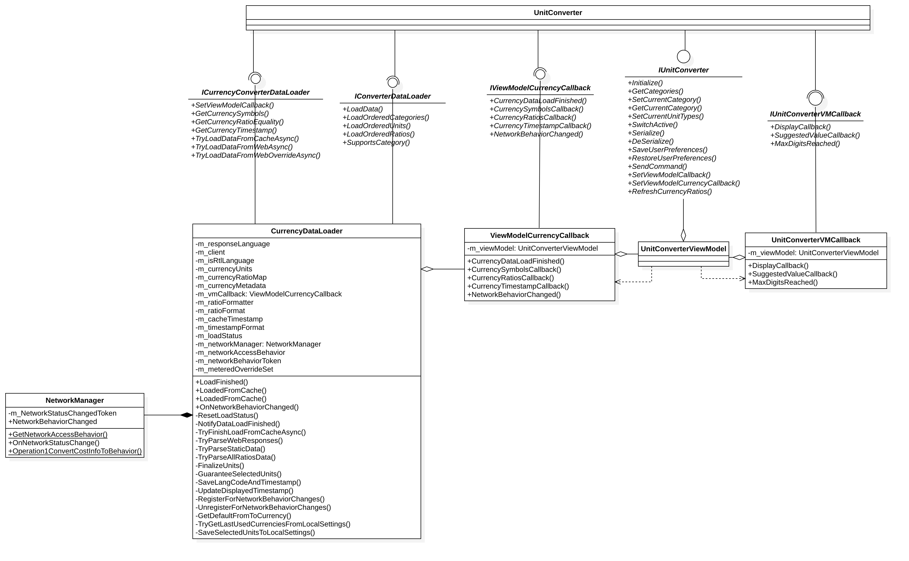
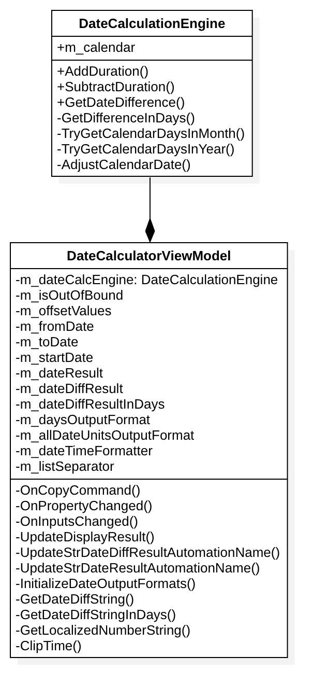

# calculatorUML
To learn the Architecture of Windows calculator，draw UML for that.

## Microsoft Calculator 

Windows Calculator [https://github.com/Microsoft/calculator]

## Tools
 
StarUML[http://staruml.io/]

## Content

### component diagram
- unitconvertor 

### class diagram
- unitconvertor 
- datecalculator 
